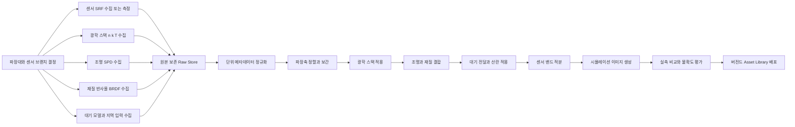
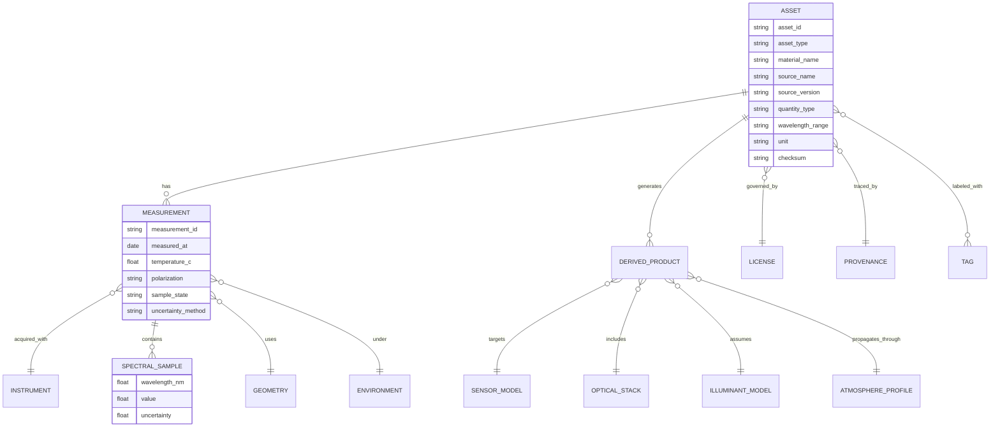

# 스펙트럼 인지 자율주행 카메라 시뮬레이션을 위한 자산 정보 수집 및 조직화

## Executive summary

이 과제의 병목은 **렌더러 자체가 아니라 자산 품질**이다. 특히 자율주행용 spectrum-aware camera simulation에서는 **센서 채널 스펙트럼 응답**, **렌즈·필터·커버글라스의 n,k 및 두께별 투과**, **실제 조명 SPD**, **재질 반사 스펙트럼과 각도 의존성**, **대기 전달/산란 파라미터**가 동시에 정리되어야 한다. 공개 자료만으로도 시작은 가능하지만, **정확한 자동차 카메라 채널 응답**, **코팅된 자동차 윈드실드/커버글라스**, **젖은 노면**, **실차 헤드램프·가로등의 luminaire-level SPD**는 빠르게 자체 계측이 필요해지는 영역이다. citeturn29view0turn17view0turn17view1turn17view2turn22search14turn40search0turn38view2

정확한 센서 모델이 지정되지 않았으므로, 실무 기본선은 **실리콘 기반 VIS+NIR 카메라 400–1100 nm**로 두고, 향후 SWIR이 필요하면 **InGaAs 계열 900–1700 nm**를 별도 브랜치로 추가하는 것이 합리적이다. 다만, 재질 라이브러리는 USGS/ECOSTRESS처럼 더 넓은 범위를 제공하므로, 내부 보관용 master grid는 **350–1700 nm** 정도로 잡고, 실제 센서 응답 계산 시에는 해당 센서 범위로 band integration 하는 구조가 가장 재사용성이 높다. EMVA 1288도 센서 스펙트럼 감도 측정 시 스캔 범위를 보통 **최소 350–1100 nm**로 잡도록 안내한다. citeturn29view0turn15search14turn15search11turn23search0turn23search9

우선순위는 분명하다. **P0**는 센서 spectral response, 광학 스택 n,k/T, 표준 daylight spectrum, 도로·식생·기본 인공재료의 스펙트럼 반사율, 대기 RTM이다. 이 다섯 축만 정리해도 VIS/NIR 카메라 시뮬레이션 품질은 크게 올라간다. **P1**는 skin, glazing, local aerosol/weather feeds, semantic material priors다. **P2**는 spectral BRDF, wet-surface, lamp-level night spectra, retroreflective road markings다. citeturn31view0turn33view0turn27search0turn40search0turn23search0turn23search1turn9search1turn9search4

데이터 조직은 **원본 보존 + 정규화 파생본 분리**가 핵심이다. 원본은 CSV/TSV/YAML/PDF 출처를 그대로 보존하고, 내부에서는 **배열 중심 저장소**와 **JSON 메타데이터**를 분리해 버전 관리하는 편이 좋다. 모든 자산에는 최소한 파장축, 물리량 종류, 단위, 각도 조건, 편광, 온도, 계측 장비, 보정 정보, 불확도, 라이선스를 붙여야 하며, 파생 센서 응답값은 원본 위에 다시 계산 가능해야 한다. citeturn33view0turn27search0turn39view0turn11search3turn35view0turn36view1

## 범위와 기본 가정

정확한 센서 모델, 렌즈 스택, 요구 BRDF 각분해능이 지정되지 않았으므로 본 보고서는 다음을 기본 가정으로 둔다. 첫째, 기본 타깃은 **실리콘 기반 RGB 또는 RGB+NIR camera**이며, 사용 파장은 사용자가 지정한 대로 **visible 400–700 nm**와 **NIR 700–1100 nm**다. 둘째, SWIR은 미지정이므로 optional branch로 두되, 실제 프로젝트에서 SWIR이 필요하면 실리콘이 아니라 InGaAs/CQD 계열 센서 여부를 먼저 확정해야 한다. 실리콘 센서의 감도는 근본적으로 1100 nm 이하에서 끝나는 반면, InGaAs는 VIS/NIR/SWIR로 확장된다. entity["organization","imec","research institute"]와 entity["company","Hamamatsu Photonics","photonics company"]의 자료도 이 구분을 뒷받침한다. citeturn15search14turn15search11turn29view0

실무 저장 범위는 센서 범위보다 약간 넓게 잡아야 한다. 이유는 세 가지다. 첫째, EMVA 1288의 스펙트럼 감도 측정 가이드는 보통 **350–1100 nm** 전 범위를 스캔하도록 권장한다. 둘째, CIE D65와 ASTM G173 같은 표준 광원은 1 nm 격자를 제공한다. 셋째, USGS와 ECOSTRESS는 1100 nm를 넘는 영역까지 포함하므로, 향후 SWIR 전환이나 물성 재사용이 쉬워진다. 따라서 **internal master grid는 1 nm 간격 350–1700 nm**, 외부 공개나 경량 배포는 5 nm 혹은 native grid를 병행하는 구성이 권장된다. 이는 표준 데이터의 해상도와 센서 적분 계산의 안정성을 함께 고려한 설계적 권고다. citeturn29view0turn27search0turn11search18turn23search0turn23search9

필요 각분해능이 미지정이므로, 초기 버전에서는 모든 재질에 spectral BRDF를 강제하지 말고 **scalar reflectance/transmittance/QE + 표면 상태 플래그**로 출발하는 편이 현실적이다. 각도 의존성이 큰 자산, 즉 **유리·코팅막·젖은 표면·강한 specular coating**에만 BRDF 또는 angle-resolved reflectance를 우선 도입하면 된다. ASTM E1392는 BRDF를 각도 분해 측정량으로 다루며, NIST는 광학 물성의 상당수가 입사각·관측각과 편광에 의존한다고 명시한다. citeturn11search3turn11search14turn35view0

## 센서 광학 조명 자산

### 센서 스펙트럼 응답

센서 spectral response는 가장 먼저 확보해야 할 자산이다. 그러나 공개 문서만 보면 한계가 뚜렷하다. entity["company","Sony Semiconductor Solutions","image sensor vendor"], entity["company","onsemi","image sensor vendor"], entity["company","OMNIVISION","image sensor vendor"]의 공개 automotive/product brief를 검색했을 때, IMX490, AR0820AT, OX08B40의 공개 PDF에서는 `spectral`이나 `quantum` 관련 텍스트가 잡히지 않았다. 즉, **public brief에는 full channel SRF/QE가 빠지는 경우가 흔하다**는 뜻이다. 이 때문에 자동차용 센서는 보통 **NDA 문서, EMVA report, 혹은 자체 측정** 중 하나가 필요하다. citeturn17view0turn17view1turn17view2turn17view3turn17view4turn17view5

EMVA 1288은 공개 가능한 가장 실무적인 기준이다. EMVA 4.0은 스펙트럼 감도 측정을 위해 별도 narrowband light source setup, calibrated photodiode, wavelength scan을 정의하고, scanned wavelength range는 보통 **350–1100 nm**를 포함하도록 권장한다. 또한 광원 bandwidth는 가능하면 **10 nm 이하**, 여건상 안 되면 **50 nm 이하**로 보고하도록 한다. 즉, **정확한 spectral response가 없으면 EMVA 방식으로 직접 측정하는 것**이 자산 라이브러리의 가장 깨끗한 출발점이다. citeturn29view0turn28view1turn16search7

EMVA report는 실제 활용 예도 있다. entity["company","Basler","machine vision camera maker"]의 EMVA report 예시는 400–1000 nm 구간의 relative quantum efficiency를 제공하고, 측정 시 thermal equilibrium과 PT100 기반 온도 모니터링까지 명시한다. 이 수준의 메타데이터가 있어야 후속 시뮬레이션에서 dark current, temperature drift, band mismatch를 해석할 수 있다. citeturn28view2turn29view1

entity["organization","IEEE","engineering society"] 계열 자료는 자동차 카메라 품질 평가 문맥에서는 중요하지만, 스펙트럼 응답의 “원천 데이터베이스” 역할은 약하다. IEEE P2020 white paper는 automated vehicles에서 camera system이 핵심이며 표준화된 metric이 필요하다고 설명하지만, 센서 채널별 spectral response curve를 제공하는 저장소는 아니다. 따라서 IEEE는 **평가 vocabulary와 test philosophy**, EMVA는 **물리 측정 프로토콜**, vendor/NDA/실측은 **값 자체**로 분리해 보는 것이 좋다. citeturn20search5turn29view0

공개형 대안도 있다. NPL 기반 reference dataset은 ground-truth spectral sensitivity와 wavelength-wise error 개념을 포함하고, Zenodo의 28-camera sensitivity database는 **400–720 nm, 10 nm 간격, 28개 camera**, 텍스트 파일 구조, **CC BY-NC-SA 4.0**을 제공한다. 다만 이들은 자동차용 최신 센서가 아니라 consumer/industrial 편향이 강하므로, **prior 또는 sanity-check**로 쓰고, production asset으로는 쓰지 않는 편이 안전하다. 한국어 참고 자료로는 상용 디지털 카메라의 분광감도 추정에 관한 국내 논문도 있으나, 이 역시 공개 추정법이지 자동차 센서의 실제 ground truth를 대체하는 것은 아니다. citeturn19search0turn31view0turn20search8

### 렌즈 필터 커버글라스와 optical stack

광학 스택은 단순 투과율 한 줄로 끝나지 않는다. 시뮬레이션에는 최소한 **재료별 n,k**, **두께**, **다층막 순서**, **AR/IR-cut/NIR-pass coating**, **coverglass 또는 windshield의 thickness-specific transmission**이 필요하다. 이때 가장 빠른 시작점은 RefractiveIndex.INFO이고, 정확도 우선의 차선책은 **vendor primary data**, 계측 traceability는 NIST다. RefractiveIndex.INFO는 공개 논문과 제조사 자료를 모은 **CC0, YAML 기반** optical constants DB다. 하지만 사이트 자체가 “no guarantee of accuracy”를 밝히므로 critical asset은 반드시 vendor or in-house data로 교차검증해야 한다. citeturn33view0

entity["company","SCHOTT","optical glass maker"]의 optical glass datasheet는 실무에 매우 유용하다. 단지 n 한 값이 아니라, **여러 파장에서의 굴절률**, **10 mm/25 mm 기준 internal transmittance**, **dn/dT**, partial dispersion까지 함께 준다. 이런 자료는 lens substrate나 coverglass 전개에 직접 쓰기 좋다. 다만 코팅된 실제 자동차용 glazing 전체를 대체하지는 못하므로, laminated glazing은 별도 파일이 필요하다. citeturn29view2turn26search13

entity["company","KLA","metrology equipment maker"] Filmetrics database는 재료별 n,k를 wavelength function으로 제공하고, 예를 들어 Si 페이지는 **200–2500 nm** 범위를 언급하며 일부 항목은 **unrestricted tab-delimited file**, 일부는 request 기반 proprietary file이다. 즉, automation에는 좋지만 **데이터 출처와 권리상태가 재료별로 균일하지 않다**는 점을 asset manifest에 남겨야 한다. citeturn34view0turn34view1

NIST는 bulk DB라기보다 **metrology authority**다. NIST는 reflectance, transmittance, emittance, absorptance, index of refraction을 다루며, 이들 중 많은 양이 **geometry와 polarization에 의존**한다고 명시한다. 또한 spectral reflectance/transmittance measurement는 **250–2500 nm**까지 SI-traceable 서비스와 calibration report를 제공한다. 얇은 코팅막 n,k는 ellipsometry, 보다 일반적인 R/T는 spectrophotometry, angle dependence는 ROSI/BRDF 계측으로 나누어 생각하는 것이 정확하다. citeturn35view0turn35view2turn37view0

### 조명 스펙트럼

주간 기준광은 논쟁의 여지가 적다. **CIE D65**는 ISO/CIE 11664-2:2022 기반 **1 nm dataset**으로 바로 받을 수 있고, **ASTM G173 / NREL AM1.5**는 outdoor solar reference spectrum의 표준 anchor다. daylight simulation에서 D65는 colorimetric reference, ASTM G173은 physically grounded solar spectrum으로 역할이 다르므로 둘 다 보관하는 편이 좋다. entity["organization","CIE","lighting standards body"]와 entity["organization","NREL","us renewable lab"]의 자료를 기본 anchor로 두면 된다. citeturn27search0turn27search2turn40search0turn11search18

야간은 더 까다롭다. **LED, halogen, headlamp, streetlight**는 CCT만으로는 충분하지 않다. halogen은 CIE illuminant A를 공통 기준으로 둘 수 있지만, 실제 automotive headlamp나 streetlight는 광원 package, phosphor mix, thermal state, optics, driver current에 따라 SPD가 크게 바뀐다. EMVA도 광원 특성은 **spectrometer로 직접 측정하는 것이 가장 좋고**, 대안으로 제조사 사양을 사용할 수 있다고 쓴다. 따라서 야간 시뮬레이션은 **catalog CCT 대신 luminaire-level SPD**를 자산으로 저장해야 한다. citeturn27search2turn29view0

다음 표는 센서·광학·조명 자산의 우선 소스를 요약한 것이다.

| 자산 | 권장 소스 | 커버리지 | 접근 | 라이선스·이용조건 | 신뢰도 | 실무 메모 |
|---|---|---|---|---|---|---|
| 센서 spectral response | public vendor brief + EMVA report + 자체 측정 citeturn17view0turn17view1turn17view2turn29view0turn28view2 | 자동차용 public brief는 불완전, EMVA는 보통 350–1100 nm 이상 스캔 citeturn29view0 | PDF / contact / lab measurement | vendor copyright, EMVA spec는 CC BY-ND citeturn29view0 | **실측/EMVA는 높음**, brochure는 중간 | 색채널별 SRF는 공개 문서에 빠지는 경우가 흔함. citeturn17view0turn17view1turn17view2 |
| 공개 SRF 보조 데이터 | NPL reference set, Zenodo 28-camera DB citeturn19search0turn31view0 | consumer/industrial 위주, 400–720 nm/10 nm 예시 citeturn31view0 | download | CC BY-NC-SA 4.0 for Zenodo DB citeturn31view0 | 중간 | prior, regularizer, sanity-check 용도. production ground truth 대체는 비추천. |
| n,k 집계 DB | RefractiveIndex.INFO, KLA Filmetrics citeturn33view0turn34view0turn34view1 | 재료별 상이, KLA 예시는 200–2500 nm Si 데이터 citeturn34view1 | YAML / TSV / web | CC0, 또는 재료별 unrestricted/request 혼합 citeturn33view0turn34view1 | 중간~높음 | 빠른 시작점으로 매우 좋지만, critical coating에는 vendor/측정 교차검증 필요. |
| 광학 유리·커버글라스 투과 | SCHOTT datasheet, LBNL Optics/Glass Library, NIST metrology citeturn29view2turn26search2turn26search5turn35view2 | 파장별 n, thickness별 internal transmittance, glazing spectral records citeturn29view2turn26search5 | PDF / software / calibration | vendor/site terms | 높음 | 자동차 glazing은 substrate 값만으로 부족하므로 laminate/coating 별도 관리 필요. |
| 주간 광원 | CIE D65, ASTM G173/NREL AM1.5 citeturn27search0turn40search0turn11search18 | D65 1 nm, G173은 400–1700 nm 구간 1 nm 제공 citeturn27search0turn11search18 | CSV / web download | 표준 데이터, citation 필수 | 매우 높음 | daylight anchor는 반드시 이 둘을 같이 보관하는 편이 좋음. |
| 야간 광원 | lamp/module vendor SPD + 현장 spectrometer 측정 citeturn29view0 | source-specific | datasheet / field measurement | vendor terms / measured internally | **실측은 높음** | LED·headlamp·streetlight는 CCT-only 시뮬레이션을 피해야 함. |

## 재질 표면 대기 자산

### 재질 반사율과 BRDF 데이터셋

재질 자산은 “하나의 대형 라이브러리”로 해결되지 않는다. 실제로는 **기본 reflectance library + domain-specific supplemental library + own measurement**의 조합이 필요하다. 광범위한 스펙트럼 베이스라인은 USGS와 ECOSTRESS가 가장 강하고, skin은 NIST가 독보적이다. BRDF는 MERL이 유용하지만 spectral이 아니라 RGB에 가깝고 research-only다. OpenSurfaces는 대규모 표면 라벨을 제공하지만 spectral truth는 아니다. entity["organization","USGS","us geological survey"], entity["organization","NASA JPL","nasa laboratory"], entity["organization","NIST","us standards agency"], entity["organization","MERL","research laboratory"]의 역할이 서로 다르다는 점을 분리해서 설계해야 한다. citeturn23search0turn23search1turn43search2turn24search0turn32view1

USGS Spectral Library v7은 **0.2–200 µm** 범위에서 수천 개 재료의 스펙트럼을 포함하고, 광물·식물·화학물질·man-made materials를 아우른다. ECOSTRESS spectral library는 **0.35–15.4 µm**, **3400개 이상 natural and man-made spectra**를 제공한다. 자동차 시뮬레이션에서는 이 둘을 합쳐 **도로, 아스팔트, 콘크리트, 페인트, vegetation, 일반 인공재료**의 baseline reflectance 라이브러리로 쓰는 것이 가장 비용 대비 효과가 높다. citeturn23search0turn23search8turn23search9

human skin은 NIST가 사실상 1순위다. NIST의 reference data set은 **100개 skin reflectance spectra, 250–2500 nm**, directional-hemispherical reflectance, national scale traceability, uncertainty 정보를 제공한다. pedestrian simulation, occupant/driver monitoring, medical-style false positive 분석에 쓰기 좋다. citeturn43search0turn43search1turn43search2turn43search10

유리와 코팅은 “재질 반사율 데이터셋”보다 **optical constants + thicknessed transmission + Fresnel/stack model**이 맞다. coverglass, windshield, rear glass, laminated coated glazing 모두 두께와 coating stack이 성능을 크게 바꾸기 때문이다. 따라서 이 항목은 USGS식 reflectance library가 아니라 SCHOTT/KLA/RefractiveIndex/LBNL/NIST 계열로 처리하는 것이 맞다. citeturn29view2turn34view1turn33view0turn26search5turn35view0

wet surfaces는 가장 큰 공백이다. 공개된 공식 표준 라이브러리 중에서 **젖은 아스팔트/젖은 콘크리트의 파장+각도+두께별 반사율**을 체계적으로 제공하는 것은 찾기 어렵다. 문헌은 wet asphalt에서 reflectance가 유의하게 변하고, water film이 거울형 반사를 키운다고 설명한다. 따라서 젖은 표면은 **dry baseline spectrum + water-film optical model + validation measurement**로 처리하는 전략이 현실적이다. citeturn22search3turn22search9turn22search14turn22search17

다음 표는 재질별 권장 소스를 요약한 것이다.

| 재질군 | 1순위 소스 | 파장·각도 커버리지 | 접근 | 라이선스 | 신뢰도 | 비고 |
|---|---|---|---|---|---|---|
| 도로, 아스팔트, 콘크리트, 일반 road paint | USGS v7 + ECOSTRESS citeturn23search0turn23search9 | USGS 0.2–200 µm, ECOSTRESS 0.35–15.4 µm, 주로 lab reflectance citeturn23search0turn23search9 | download / web search | USGS는 대부분 public domain, NASA 데이터는 일반적으로 공개 접근 관행 citeturn23search8turn30search11 | 높음 | baseline spectral albedo에 적합. 각도 의존성은 별도 필요. |
| 식생 | USGS + ECOSTRESS citeturn23search0turn23search9 | VIS-NIR-SWIR-LWIR까지 넓음 | download | 위와 동일 | 높음 | NIR/SWIR 분리가 좋아 vegetation separability 확보에 유리. |
| 피부 | NIST human skin reference set citeturn43search2turn43search10 | 250–2500 nm, directional-hemispherical, uncertainty 포함 citeturn43search1turn43search2 | publication / data catalog | 미국 정부/NIST publication 기반 | 매우 높음 | pedestrian·occupant 관련 human material의 사실상 표준 출발점. |
| 유리, 커버글라스, 코팅막 | SCHOTT, KLA, RefractiveIndex.INFO, LBNL Optics citeturn29view2turn34view1turn33view0turn26search5 | 재료별 n,k와 thickness-specific T | PDF / TSV / YAML / software | 혼합 | 높음 | reflectance dataset보다 optical stack 모델링이 맞음. |
| BRDF 형상 baseline | MERL BRDF DB citeturn24search0turn24search4turn25view0 | dense isotropic BRDF, 100 materials, RGB color component 기반 citeturn25view0turn25view2 | download | research/academic use only citeturn23search6 | BRDF 형상은 높음, spectral 측면은 낮음 | spectral BRDF가 아니라는 점을 반드시 명시해야 함. |
| semantic material prior | OpenSurfaces citeturn32view0turn32view1 | spectral 없음, 사진 기반 표면 라벨 | S3 / GitHub / web | annotations CC BY 4.0, photos는 각자 라이선스 citeturn32view1 | 중간 | material class prior용. spectral truth 용도는 아님. |
| wet surface | 단일 1순위 공개 라이브러리 없음. dry USGS/ECOSTRESS + wet-road 모델 + 자체 계측 권장 citeturn22search3turn22search14 | literature-dependent | 논문 + own measurement | 혼합 | 중간 | water-film thickness와 specular lobe를 별도 자산으로 두는 편이 좋음. |

추가로, 사용자가 예시로 든 AIST는 이번 조사에서는 **공식·개방형 자동차 재료 스펙트럼 라이브러리**로서 USGS/ECOSTRESS만큼 직접적인 자료는 확인되지 않았다. 검색된 AIST 관련 항목은 원격탐사·ASTER 계열 문서와 반사율 관련 연구에 가까웠다. 따라서 AIST는 **일본권 supplementary source** 정도로 두고, 1차 구축에는 USGS/ECOSTRESS/NIST를 우선하는 편이 좋다. entity["organization","AIST","japan research institute"] citeturn8search8turn8search13turn8search15

### 대기 효과와 지역 입력 데이터

대기 효과는 post-processing 필터가 아니라 **scene-to-sensor 전달 함수**다. clear/clean atmosphere, aerosol-loaded sky, fog, rain을 서로 다른 asset family로 관리해야 한다. clear-sky와 molecular absorption/scattering에는 **MODTRAN**과 **libRadtran**이 대표적이다. MODTRAN은 **0.2 µm 이상 광범위 스펙트럼**에서 LOS transmittance/radiance를 다루는 상용 RTM이고, libRadtran은 `uvspec`를 중심으로 하는 공개 RT toolchain이며 **Mie 계산**, **aerosol optical depth**, **single scattering albedo**, **phase function inputs**를 다룰 수 있다. **6S**는 solar reflection 기반 LUT나 atmospheric correction 계열에 여전히 유용하다. citeturn9search4turn9search1turn30search2turn9search2

대기 상태 입력은 표준 atmosphere만으로 충분하지 않다. aerosol은 **AERONET AOD**가 가장 실용적인 공개 기준이고, NASA는 Version 3 AOD 자료를 웹에서 표시·다운로드할 수 있게 한다. 한국 지역 시뮬레이션이라면 여기에 **기상청 API허브**, **국립환경과학원 GEMS Open-API**, **국가기상위성센터 ATBD**, **에어코리아 OpenAPI**를 붙여야 한다. 기상청은 지상관측·수치모델·위성 등 API 허브를 제공하고, GEMS는 key-based Open-API로 이미지/데이터 제품을 내려준다. 국가기상위성센터는 fog, aerosol optical depth, aerosol visibility, surface reflectance, shortwave radiation 관련 ATBD 문서를 공개한다. 에어코리아 API는 **REST, JSON/XML, 실시간 갱신**이며 라이선스는 **공공누리 제3유형/변경금지**다. entity["organization","기상청","national weather agency"], entity["organization","국립환경과학원","korea environmental institute"], entity["organization","한국환경공단","korea environmental service"]의 공개 소스를 한국 배포 버전에 우선 연결하는 것이 좋다. citeturn30search0turn38view0turn38view1turn38view2turn39view0turn39view2

모델 선택은 환경별로 나누면 된다. fog는 우선 visibility/extinction 파라미터 기반의 **Koschmieder 계열 모델**이나 Mie 기반 aerosol/fog model로 관리하는 것이 실용적이고, rain은 **Marshall–Palmer drop-size distribution**을 기본선으로 두어 spectral attenuation 또는 camera degradation model에 연결하면 된다. 다만 자동차 카메라용 rain/fog의 공개 표준 자산은 충분하지 않으므로, adverse weather는 model parameter asset으로 다루고 실측 데이터로 튜닝하는 편이 낫다. citeturn10search0turn10search1turn9search1

## 메타데이터 포맷 검증

### 메타데이터와 측정 표준

좋은 asset library는 값 자체보다 **조건 메타데이터**가 더 중요하다. EMVA 1288은 sensor operation point, wavelength scan 조건, bandwidth, calibration photodiode를 명시하고, ASTM E1392는 BRDF를 각도 분해 측정량으로 다룬다. NIST는 optical properties가 geometry와 polarization에 의존한다고 강조한다. 따라서 최소 스키마는 아래 정도를 권장한다. citeturn29view0turn11search3turn35view0

| 필드 | 권장 내용 |
|---|---|
| `wavelength_nm` | 원본 native grid와 resampled grid를 모두 기록 |
| `quantity_type` | `reflectance`, `transmittance`, `n`, `k`, `qe`, `spectral_response`, `spd`, `brdf` |
| `units` | 차원 없는 비율인지, W·m^-2·nm^-1인지, relative normalization인지 명시 |
| `geometry` | 입사/관측 zenith·azimuth, hemispherical 여부, directionality |
| `polarization` | unpolarized, s, p, Mueller/Stokes basis 여부 |
| `temperature_c` | sensor temperature, sample temperature, ambient temperature 분리 |
| `sample_state` | dry, wet, coated, aged, dusty, laminated 등 |
| `instrument` | spectrophotometer, ellipsometer, monochromator, integrating sphere, goniometer |
| `calibration_ref` | calibrated photodiode, SRM, reference reflector, standard lamp |
| `uncertainty` | wavelength-wise standard uncertainty, 가능하면 covariance 또는 method note |
| `provenance` | source URL/DOI, ingest date, version, license, checksum |

파장 샘플링은 **원본 보존**이 우선이고, 내부 계산용 표준 grid만 별도로 두는 것이 좋다. CIE D65는 1 nm, ASTM G173도 400–1700 nm 구간에서 1 nm 간격을 쓴다. ASTM G214는 스펙트럼 데이터셋의 wavelength interval은 반드시 uniform일 필요는 없지만, **matching and alignment**가 중요하며 균일한 간격이 계산을 단순화한다고 설명한다. 따라서 **raw는 native grid**, **compute는 1 nm master grid**, **배포는 1/5/10 nm derivative** 구조가 균형이 좋다. citeturn27search0turn11search18turn11search0

### 데이터 포맷과 API

외부 원천 포맷은 이미 매우 이질적이다. RefractiveIndex.INFO는 **YAML**, CIE는 **CSV + metadata JSON**, AirKorea는 **REST JSON/XML**, MatDB는 **RESTful machine interface**, OPTIMADE는 **표준화된 materials API**, Materials Project는 **mp-api**를 제공한다. 즉, ingestion 계층은 CSV/TSV/YAML/JSON/XML을 모두 흡수할 수 있어야 한다. citeturn33view0turn27search0turn39view0turn12search0turn12search2turn12search3turn12search7

내부 저장은 원천 포맷을 그대로 이어붙이기보다, **배열은 HDF5 같은 binary container**, 메타데이터는 **JSON sidecar 또는 document store**, 검색 인덱스는 **material ID / source / wavelength coverage / license / uncertainty** 중심으로 분리하는 편이 낫다. OPTIMADE, entity["organization","Materials Project","materials database"] API, matminer, matDB는 optical spectrum 자체를 주는 경우가 드물지만, **재료 동일성, 조성, 구조, reference linking**에는 유용하다. 따라서 이들은 “spectrum source”가 아니라 “asset identity layer”로 쓰는 것이 맞다. citeturn12search0turn12search3turn12search9turn12search2

### 검증과 불확도

검증은 source ranking이 아니라 **measurement method + traceability + uncertainty budget**로 해야 한다. reflectance/transmittance는 spectrophotometer와 integrating sphere가 기본이고, thin-film n,k와 thickness는 ellipsometry가 핵심이다. NIST는 spectral reflectance/transmittance의 calibration report에 uncertainty를 포함하며, ROSI는 UV–SWIR bidirectional reflectance와 uncertainty budget을 다룬다. citeturn35view2turn36view0turn36view1

ellipsometry 쪽에서는 NIST의 focused-beam spectroscopic Mueller matrix ellipsometer가 **245–1000 nm**, 11개 Mueller matrix element, sample rotation capability를 제공하고, J.A. Woollam 자료는 ellipsometry가 **Ψ/Δ polarization change**를 통해 film thickness와 optical constants를 동시에 추정한다고 설명한다. 따라서 코팅된 coverglass, IR-cut, AR stack에는 ellipsometry가 가장 적합하다. 반면 bulk painted surface나 road material에는 spectrophotometer/BRDF rig가 더 낫다. citeturn37view0turn37view1turn37view2

sensor 측면에서는 EMVA 절차처럼 **same operation point**, **calibrated photodiode**, **narrowband scan**, **thermal equilibrium**을 지키는 것이 중요하다. Basler 예시처럼 PT100 또는 내부 센서로 온도를 남기지 않으면, later-stage simulation에서 sensitivity drift와 dark current를 분리하기 어렵다. citeturn29view0turn28view2

## 구축 워크플로와 우선순위

실행 워크플로는 다음 순서를 권장한다.

1. **센서 브랜치 결정**  
   실리콘 400–1100 nm만 필요한지, SWIR 900–1700 nm 브랜치를 병행할지 먼저 결정한다. 이 결정이 광학 스택, illuminant, material library 범위를 바꾼다. citeturn15search14turn15search11turn29view0

2. **P0 자산 확보**  
   센서 spectral response, 렌즈·필터·coverglass의 n,k/T, D65와 ASTM G173, USGS+ECOSTRESS baseline reflectance, libRadtran 또는 MODTRAN 기반 atmosphere, AERONET 및 한국 지역 대기 입력을 먼저 수집한다. 이 다섯 축이 scene-to-sensor simulation의 최소 폐루프를 만든다. citeturn31view0turn33view0turn27search0turn40search0turn23search0turn23search1turn9search1turn30search0turn38view1

3. **원본 보존과 정규화 분리**  
   raw file은 checksum과 함께 immutable 저장소에 두고, 정규화 파생본만 내부 canonical schema로 변환한다. 예를 들어 raw YAML/CSV/PDF는 그대로 보관하고, canonical store에는 wavelength array, quantity, unit, uncertainty, provenance, license를 재기록한다. citeturn33view0turn27search0turn39view0

4. **파장 정렬과 band product 생성**  
   모든 자산을 native grid에서 1 nm internal grid로 보간하되, 원본보다 더 높은 주파수 내용을 “창조”하지 않도록 interpolation rule을 자산별로 다르게 둔다. LED/filter edge는 1 nm, broader reflectance는 native 또는 5 nm도 충분한 경우가 많다. 이후 sensor channel SRF로 band integration 해 `R/G/B/NIR/SWIR` response product를 만든다. citeturn27search0turn11search18turn11search0

5. **validation scene 구축**  
   dry asphalt, wet asphalt, vegetation, skin, clear glass, coated glass, painted metal 같은 representative scene을 지정하고, spectrometer/monochromator 기반 촬영과 시뮬레이션 결과를 비교한다. 불일치는 asset error인지 renderer error인지 분리해서 asset registry에 feedback loop를 만든다. citeturn22search3turn43search2turn35view2turn29view0

6. **버전 관리와 권리 관리**  
   같은 material ID라도 source version, processing code version, temperature, coating 상태가 다르면 별도 asset version으로 관리한다. 특히 research-only, no-derivatives, mixed-photo-license 데이터는 학습·배포·제품화 범위를 분리해야 한다. citeturn23search6turn32view1turn39view2

다음 표는 실무 우선순위를 요약한 것이다.

| 우선순위 | 데이터셋·도구 | 지금 필요한 이유 | 라이선스·권리 리스크 | 비고 |
|---|---|---|---|---|
| P0 | 센서 SRF 실측 또는 EMVA report citeturn29view0turn28view2turn17view0 | 자율주행 perception에 가장 직접적인 오차원 | public brief는 불완전, vendor/NDA 의존 가능 | project-specific asset로 보는 것이 맞음 |
| P0 | RefractiveIndex.INFO + SCHOTT + KLA + exact vendor stack citeturn33view0turn29view2turn34view1 | optics stack이 sensor 이전의 spectral filtering을 결정 | mixed terms, 출처 다양성 | coverglass/windshield는 thickness/coating 분리 필요 |
| P0 | CIE D65 + ASTM G173/NREL citeturn27search0turn40search0turn11search18 | daylight reference anchor | 낮음 | D65와 solar reference를 동시에 보관 |
| P0 | USGS v7 + ECOSTRESS citeturn23search0turn23search9 | road/vegetation/man-made baseline 확보 | 낮음~중간 | 가장 먼저 ingest 하기 좋은 반사율 라이브러리 |
| P0 | libRadtran/MODTRAN + AERONET + 한국 API feeds citeturn9search1turn9search4turn30search0turn38view0turn38view1turn39view0 | clear/fog/aerosol/rain sensitivity 분석의 기반 | MODTRAN은 상용, AirKorea는 변경금지 citeturn39view2 | local weather를 scenario asset로 분리 |
| P1 | NIST skin reference set citeturn43search2 | pedestrian/occupant realism 향상 | 낮음 | uncertainty와 traceability가 강점 |
| P1 | LBNL glazing spectral resources citeturn26search2turn26search5 | glazing spectral stack 보강 | tool/site terms 확인 필요 | coated automotive glazing 보완용 |
| P1 | OpenSurfaces citeturn32view0turn32view1 | semantic material prior, domain label 보강 | annotations와 photo license 분리 관리 필요 | spectral truth로 사용 금지 |
| P2 | MERL BRDF citeturn24search0turn23search6 | angular behavior baseline | research-only | spectral BRDF가 아님 |
| P2 | wet-road / lamp SPD / coated glazing 자체 계측 citeturn22search14turn29view0 | 공개 라이브러리 공백 보완 | 내부 정책에 따름 | 장기적으로 가장 가치가 큰 proprietary asset |

명시적 gap도 분명하다. **정확한 automotive RGB/NIR channel SRF**, **실차 headlamp/streetlight SPD**, **wet asphalt와 retroreflective road marking의 spectral BRDF**, **코팅된 windshield/coverglass stack**은 공개 자료만으로 끝내기 어렵다. 이 네 항목은 처음부터 “계측 예정 자산”으로 backlog에 올려두는 것이 좋다. citeturn17view0turn17view1turn17view2turn22search14turn35view0

## 구현 예시

아래 코드는 위에서 정리한 자산 구조를 실제 계산으로 연결하는 최소 예시다. 첫 번째는 **n,k → Fresnel reflectance**이고, 두 번째는 **고해상도 스펙트럼을 센서 spectral response로 resampling·적분**해 픽셀 응답을 구하는 코드다. 코드 자체는 표준 Fresnel 광학과 스펙트럼 적분을 구현한 것이다. 실제 사용 시에는 입력 스펙트럼의 단위와 geometry를 반드시 메타데이터와 함께 맞춰야 한다. citeturn35view1turn37view2turn29view0

### n,k에서 반사율 계산

```python
import numpy as np
from typing import Tuple


def _ensure_complex_index(n: np.ndarray, k: np.ndarray) -> np.ndarray:
    """Return complex refractive index N = n + i k."""
    n = np.asarray(n, dtype=float)
    k = np.asarray(k, dtype=float)
    if n.shape != k.shape:
        raise ValueError("n and k must have the same shape.")
    return n + 1j * k


def reflectance_normal_incidence(
    n2: np.ndarray,
    k2: np.ndarray,
    n1: float = 1.0,
) -> np.ndarray:
    """
    Normal-incidence reflectance R for interface n1 -> (n2 + i k2).

    Parameters
    ----------
    n2, k2
        Arrays for the material optical constants.
    n1
        Refractive index of incident medium (air=1.0 by default).

    Returns
    -------
    R : ndarray
        Reflectance (0..1+ numerical tolerance).
    """
    N2 = _ensure_complex_index(n2, k2)
    r = (n1 - N2) / (n1 + N2)
    return np.abs(r) ** 2


def fresnel_sp_reflectance(
    n2: np.ndarray,
    k2: np.ndarray,
    theta_i_deg: float | np.ndarray,
    n1: float = 1.0,
) -> Tuple[np.ndarray, np.ndarray]:
    """
    Oblique-incidence Fresnel reflectance for s- and p-polarization
    at an interface n1 -> (n2 + i k2).

    Parameters
    ----------
    n2, k2
        Arrays for the material optical constants.
    theta_i_deg
        Incident angle in degrees, scalar or array-broadcastable.
    n1
        Refractive index of incident medium.

    Returns
    -------
    Rs, Rp : ndarray
        s- and p-polarized reflectance.
    """
    N2 = _ensure_complex_index(n2, k2)
    theta_i = np.deg2rad(theta_i_deg)
    cos_i = np.cos(theta_i)
    sin_i = np.sin(theta_i)

    # Complex Snell law
    sin_t = n1 * sin_i / N2
    cos_t = np.sqrt(1.0 - sin_t**2 + 0j)

    # Choose the branch with non-negative imaginary/real behavior
    flip = np.real(cos_t) < 0
    cos_t = np.where(flip, -cos_t, cos_t)

    rs = (n1 * cos_i - N2 * cos_t) / (n1 * cos_i + N2 * cos_t)
    rp = (N2 * cos_i - n1 * cos_t) / (N2 * cos_i + n1 * cos_t)

    Rs = np.abs(rs) ** 2
    Rp = np.abs(rp) ** 2
    return Rs, Rp


if __name__ == "__main__":
    wavelength_nm = np.array([450, 550, 650, 850], dtype=float)
    n = np.array([1.52, 1.51, 1.50, 1.49], dtype=float)
    k = np.array([0.0, 0.0, 0.0, 0.0], dtype=float)

    R0 = reflectance_normal_incidence(n, k, n1=1.0)
    Rs, Rp = fresnel_sp_reflectance(n, k, theta_i_deg=45.0, n1=1.0)

    print("wavelength_nm =", wavelength_nm)
    print("R_normal =", R0)
    print("Rs_45deg =", Rs)
    print("Rp_45deg =", Rp)
```

### 스펙트럼을 센서 응답으로 resampling하고 픽셀 응답 계산

```python
import numpy as np
from typing import Dict


H = 6.62607015e-34  # Planck constant [J*s]
C = 299792458.0     # Speed of light [m/s]


def interp_spectrum(
    wl_src_nm: np.ndarray,
    y_src: np.ndarray,
    wl_dst_nm: np.ndarray,
    left: float = 0.0,
    right: float = 0.0,
) -> np.ndarray:
    """
    Linear interpolation of a spectrum onto a new wavelength grid.
    """
    wl_src_nm = np.asarray(wl_src_nm, dtype=float)
    y_src = np.asarray(y_src, dtype=float)
    wl_dst_nm = np.asarray(wl_dst_nm, dtype=float)

    if wl_src_nm.ndim != 1 or y_src.ndim != 1:
        raise ValueError("wl_src_nm and y_src must be 1D arrays.")
    if wl_src_nm.shape[0] != y_src.shape[0]:
        raise ValueError("wl_src_nm and y_src must have the same length.")
    if np.any(np.diff(wl_src_nm) <= 0):
        raise ValueError("wl_src_nm must be strictly increasing.")

    return np.interp(wl_dst_nm, wl_src_nm, y_src, left=left, right=right)


def relative_channel_response(
    wl_nm: np.ndarray,
    illuminant_spd: np.ndarray,
    surface_reflectance: np.ndarray,
    optics_transmittance: np.ndarray,
    channel_srf: np.ndarray,
) -> float:
    """
    Relative band response:
        response ~ ∫ E(λ) * R(λ) * T_optics(λ) * SRF(λ) dλ

    All inputs may be relative. Output is therefore relative.
    """
    wl_nm = np.asarray(wl_nm, dtype=float)
    signal = (
        np.asarray(illuminant_spd, dtype=float)
        * np.asarray(surface_reflectance, dtype=float)
        * np.asarray(optics_transmittance, dtype=float)
        * np.asarray(channel_srf, dtype=float)
    )
    return float(np.trapezoid(signal, wl_nm))


def electrons_from_radiance(
    wl_nm: np.ndarray,
    scene_radiance_w_m2_sr_nm: np.ndarray,
    optics_transmittance: np.ndarray,
    quantum_efficiency: np.ndarray,
    aperture_area_m2: float,
    pixel_solid_angle_sr: float,
    exposure_time_s: float,
) -> float:
    """
    Approximate photoelectrons reaching one pixel:

        photons(λ) = L(λ) * A * Ω * λ / (h c)

    Then multiply by optics transmission and quantum efficiency, and integrate.
    """
    wl_nm = np.asarray(wl_nm, dtype=float)
    wl_m = wl_nm * 1e-9

    radiance = np.asarray(scene_radiance_w_m2_sr_nm, dtype=float)
    T = np.asarray(optics_transmittance, dtype=float)
    QE = np.asarray(quantum_efficiency, dtype=float)

    photon_rate_per_nm = radiance * aperture_area_m2 * pixel_solid_angle_sr * wl_m / (H * C)
    electron_rate_per_nm = photon_rate_per_nm * T * QE

    # dλ integration in nm, so convert to meters by *1e-9
    electrons = exposure_time_s * np.trapezoid(electron_rate_per_nm, wl_nm) * 1e-9
    return float(electrons)


def multispectral_to_sensor_bands(
    wl_highres_nm: np.ndarray,
    illuminant_spd: np.ndarray,
    surface_reflectance: np.ndarray,
    optics_transmittance: np.ndarray,
    sensor_wl_nm: np.ndarray,
    sensor_srf: Dict[str, np.ndarray],
) -> Dict[str, float]:
    """
    Resample high-resolution spectra to a sensor wavelength grid and compute
    relative channel responses.

    sensor_srf example:
        {
            "R": R_channel_srf,
            "G": G_channel_srf,
            "B": B_channel_srf,
            "NIR": nir_channel_srf,
        }
    """
    E = interp_spectrum(wl_highres_nm, illuminant_spd, sensor_wl_nm)
    Rho = interp_spectrum(wl_highres_nm, surface_reflectance, sensor_wl_nm)
    T = interp_spectrum(wl_highres_nm, optics_transmittance, sensor_wl_nm)

    out = {}
    for band_name, srf in sensor_srf.items():
        srf = np.asarray(srf, dtype=float)
        if srf.shape != sensor_wl_nm.shape:
            raise ValueError(f"SRF shape mismatch for band '{band_name}'.")
        out[band_name] = relative_channel_response(sensor_wl_nm, E, Rho, T, srf)
    return out


if __name__ == "__main__":
    # Example high-resolution scene spectrum (1 nm)
    wl_hr = np.arange(400.0, 1001.0, 1.0)
    illuminant = np.exp(-0.5 * ((wl_hr - 560.0) / 120.0) ** 2)  # toy daylight-like SPD
    reflectance = 0.1 + 0.4 * np.exp(-0.5 * ((wl_hr - 850.0) / 60.0) ** 2)  # toy vegetation-like NIR bump
    optics_T = np.where(wl_hr < 700.0, 0.95, 0.80)  # toy VIS-pass / weaker NIR transmission

    # Example sensor wavelength grid and channel SRFs
    wl_sensor = np.arange(400.0, 1001.0, 5.0)
    R_srf = np.exp(-0.5 * ((wl_sensor - 610.0) / 35.0) ** 2)
    G_srf = np.exp(-0.5 * ((wl_sensor - 540.0) / 30.0) ** 2)
    B_srf = np.exp(-0.5 * ((wl_sensor - 460.0) / 25.0) ** 2)
    NIR_srf = np.exp(-0.5 * ((wl_sensor - 850.0) / 70.0) ** 2)

    responses = multispectral_to_sensor_bands(
        wl_highres_nm=wl_hr,
        illuminant_spd=illuminant,
        surface_reflectance=reflectance,
        optics_transmittance=optics_T,
        sensor_wl_nm=wl_sensor,
        sensor_srf={"R": R_srf, "G": G_srf, "B": B_srf, "NIR": NIR_srf},
    )

    print("Relative band responses:", responses)
```

### suggested mermaid diagram

아래 flowchart는 source → normalization → simulation → validation까지의 데이터 파이프라인을 요약한 예시다. EMVA, NIST, ASTM, CIE 계열 요구사항을 반영하면 이런 구조가 가장 관리하기 쉽다. citeturn29view0turn35view2turn11search3turn27search0



아래 ER 다이어그램은 asset registry에 추천하는 메타데이터 관계 예시다. 핵심은 **값 배열**, **측정 조건**, **출처·권리**, **파생본 관계**를 분리하는 것이다. citeturn35view0turn36view0turn36view1turn33view0turn39view0

