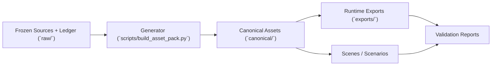

# 진행 보고서

발표용 HTML deck: [progress-report-slides.html](progress-report-slides.html)

외부/데모용 슬라이드 아웃라인  
프로젝트: `Autonomous Driving Camera Simulation Asset Pack`

## Slide 1 — 제목 / 한 줄 요약

- 스냅샷 날짜: `2026년 4월 26일`
- 한 줄 요약: 검증 가능한 자산 팩 기반이 안정화되었고, 현재 병목은 자산 수가 아니라 측정 데이터 확보입니다.
- 이 문서는 서술형 보고서가 아니라 발표용 슬라이드 아웃라인입니다.
- 목표는 현재 baseline, 실제 자산 예시, 검증 상태, 남은 리스크, 다음 단계를 짧고 명확하게 보여주는 것입니다.

---

## Slide 2 — 소스는 어디서 오나

- 이 저장소는 임의로 웹 자산을 끌어다 쓰지 않고, provenance가 기록된 source를 먼저 `raw/`에 동결한 뒤 생성에 사용합니다.
- source origin은 크게 `url`과 `local_path` 두 가지이며, 상태와 checksum은 [`raw/source_ledger.json`](/Users/seongcheoljeong/Documents/SpectralAsset/raw/source_ledger.json)에 기록됩니다.
- source classification과 `403` fallback 규칙은 [`docs/source-policy.md`](/Users/seongcheoljeong/Documents/SpectralAsset/docs/source-policy.md)에 명시되어 있습니다.

| Source bucket | 실제 예시 | 현재 용도 |
| --- | --- | --- |
| 공개 수치 데이터 | `cie_d65_csv`, `cie_led_illuminants_csv`, `astm_g173_zip` | illuminant / emitter baseline |
| 동결된 material subset | `usgs_splib07_selected/` | `mat_asphalt_dry`, `mat_concrete`, `mat_metal_galvanized` |
| vendor / official reference | `balluff_imx900_emva_report_pdf`, `onsemi_mt9m034_pdf`, `osram_*`, `fhwa_*` | camera `v3`, signal SPD, night priors context |
| taxonomy / help reference | `osm_traffic_sign_wiki`, `unece_road_signs_page`, `mapillary_*` | sign family reference, provenance, fallback docs |

- blocked `403` source도 삭제하지 않고 `fetch_failed`로 남겨서 provenance gap을 숨기지 않습니다.

---

## Slide 3 — 어떻게 asset을 만드는가

- 핵심 생성기는 [`scripts/build_asset_pack.py`](/Users/seongcheoljeong/Documents/SpectralAsset/scripts/build_asset_pack.py)입니다.
- raw source는 바로 runtime asset이 되지 않고, generator를 거쳐 `canonical/`, `exports/`, `validation/` 산출물로 정리됩니다.



| Build path | 어떻게 만들어지는가 |
| --- | --- |
| Sign asset | reference taxonomy → `canonical/templates/signs/*.svg` → `canonical/geometry/usd/` + `canonical/manifests/` → `exports/gltf/*.glb` |
| Spectral / camera asset | CIE / USGS / vendor docs → `canonical/spectra/` → `canonical/materials/`, `canonical/emissive/`, `canonical/camera/` |
| Final check | scenes와 exports를 함께 돌려 `validation/reports/`에 현재 truth를 남김 |

- 즉, “source를 다운로드해서 끝”이 아니라 “source를 동결하고, generator rule로 canonical asset으로 변환하고, export와 validation까지 함께 만든다”가 실제 workflow입니다.

---

## Slide 4 — 현재 기준선 Snapshot

| 항목 | 현재 값 |
| --- | --- |
| 총 자산 수 | `379` |
| `traffic_sign` | `90` |
| `traffic_light` | `61` |
| `road_surface` | `57` |
| `road_marking` | `69` |
| `road_furniture` | `102` |
| Spectral materials | `27` |
| Emissive profiles | `33` |
| Camera profiles | `3` |
| Scenario profiles | `4` |
| Validation scenes | `4` |
| Checked GLBs | `383` |
| GLB errors | `0` |
| GLB warnings | `0` |
| Release gates | `pass` |
| Active camera | `camera_reference_rgb_nir_v3` |

현재 baseline은 깨끗하게 검증되며, active camera는 measured가 아닌 public-data `vendor_derived` 기준선입니다.

---

## Slide 5 — 얼마나 확장되었는가

- 현재 breadth는 첫 `57`개 `P3` 확장 배치의 결과입니다.
- 핵심 메시지는 “starter asset 부족” 문제가 아니라, 이제는 “depth / fidelity / measured data”가 주요 병목이라는 점입니다.

```mermaid
flowchart TB
    A["`traffic_sign`\n18 → 90"] --> F["count-expanded baseline"]
    B["`traffic_light`\n5 → 61"] --> F
    C["`road_surface`\n4 → 57"] --> F
    D["`road_marking`\n4 → 69"] --> F
    E["`road_furniture`\n4 → 102"] --> F
    F --> G["현재 병목: measured data / fidelity / support-tail depth"]
```

---

## Slide 6 — 실제 자산 예시: Sign face gallery

| 규제 표지 | Route shield |
| --- | --- |
| 규제 표지<br><br>[`sign_stop.svg`](/Users/seongcheoljeong/Documents/SpectralAsset/canonical/templates/signs/sign_stop.svg) | route shield<br><br>[`sign_route_interstate_5_shield.svg`](/Users/seongcheoljeong/Documents/SpectralAsset/canonical/templates/signs/sign_route_interstate_5_shield.svg) |

| Service / wayfinding | Overhead guide |
| --- | --- |
| service/wayfinding<br><br>[`sign_ferry_arrow_right.svg`](/Users/seongcheoljeong/Documents/SpectralAsset/canonical/templates/signs/sign_ferry_arrow_right.svg) | overhead guide<br><br>[`sign_overhead_platform_refuge_split.svg`](/Users/seongcheoljeong/Documents/SpectralAsset/canonical/templates/signs/sign_overhead_platform_refuge_split.svg) |

- 이 슬라이드는 실제 repo SVG template만 사용합니다.
- 별도 편집 이미지나 재가공 렌더는 포함하지 않습니다.

---

## Slide 7 — 실제 자산 예시: 3D asset coverage

| Family | Representative asset | File link | Why it matters |
| --- | --- | --- | --- |
| `traffic_sign` | `sign_stop` | [`sign_stop.glb`](../exports/gltf/sign_stop.glb) | 기본 규제 표지 자산이 실제 export로 존재함 |
| `traffic_sign` | `sign_overhead_platform_refuge_split` | [`sign_overhead_platform_refuge_split.glb`](../exports/gltf/sign_overhead_platform_refuge_split.glb) | overhead assembly까지 개별 자산으로 확장됨 |
| `traffic_light` | `signal_vehicle_vertical_3_aspect` | [`signal_vehicle_vertical_3_aspect.glb`](../exports/gltf/signal_vehicle_vertical_3_aspect.glb) | 기본 vehicle head 기준선 |
| `traffic_light` | `signal_bus_platform_compact_3_aspect` | [`signal_bus_platform_compact_3_aspect.glb`](../exports/gltf/signal_bus_platform_compact_3_aspect.glb) | multimodal / platform follow-up 반영 |
| `road_surface` | `road_transit_platform_bulbout` | [`road_transit_platform_bulbout.glb`](../exports/gltf/road_transit_platform_bulbout.glb) | 도로 패널이 urban starter set을 넘어섬 |
| `road_marking` | `marking_bus_only_box_white` | [`marking_bus_only_box_white.glb`](../exports/gltf/marking_bus_only_box_white.glb) | curbside / transit marking depth를 보여줌 |
| `road_furniture` | `furniture_bus_stop_shelter` | [`furniture_bus_stop_shelter.glb`](../exports/gltf/furniture_bus_stop_shelter.glb) | support-tail asset이 독립 자산으로 관리됨 |

상단 preview는 공유 호환성을 위해 deck에 포함한 정적 PNG 이미지이고, 실제 3D 자산 확인은 아래 `GLB` 링크를 사용합니다.

---

## Slide 8 — Scene integration and validation

| Scene | 역할 |
| --- | --- |
| [`scene_sign_test_lane.usda`](../canonical/scenes/scene_sign_test_lane.usda) | sign / lane marking coverage 확인 |
| [`scene_signalized_intersection.usda`](../canonical/scenes/scene_signalized_intersection.usda) | multimodal intersection coverage 확인 |
| [`scene_night_retroreflection.usda`](../canonical/scenes/scene_night_retroreflection.usda) | night / retroreflection context 확인 |
| [`scene_wet_road_braking.usda`](../canonical/scenes/scene_wet_road_braking.usda) | wet-road behavior context 확인 |

- `383` GLB checked
- `0` errors
- `0` warnings
- release gates `pass`

자산은 개별 파일로만 존재하는 것이 아니라, validation scene 안에서 실제 조합과 문맥까지 함께 검증됩니다.

---

## Slide 9 — 남은 리스크와 현재 fallback

| Gap | Status | Current fallback |
| --- | --- | --- |
| measured automotive SRF | `blocked` | `camera_reference_rgb_nir_v3` |
| measured traffic-signal/headlamp SPD | `blocked` | vendor-derived signal SPDs + public night priors |
| measured retroreflective sheeting | `blocked` | proxy shared gain curve |
| measured wet-road data | `blocked` | simplified measured-derived wet path |

- 일부 upstream source는 여전히 `403` 상태입니다.
- retroreflective / wet-road 모델은 아직 full angle-aware BRDF가 아닙니다.
- 현재 fallback path는 모두 구현되어 있지만, fidelity ceiling은 여전히 measured data 확보에 의해 결정됩니다.

---

## Slide 10 — 다음 단계

- Immediate:
  - `P3-T061`
  - `road_furniture`의 transit-platform controller microsupport, curbside-priority attachments, separator-island hardware follow-up
- Near-term recommendation:
  - support-tail 확장이 실제 데모 가치가 있는 경우에만 계속
- Strategic recommendation:
  - 가장 큰 fidelity unlock은 measured-data acquisition
- 명시할 메시지:
  - intake tooling은 이미 존재하지만, measured backlog는 아직 열려 있습니다.

다음 단계는 “더 많은 자산 수”보다 “어떤 자산이 발표/시뮬레이션 가치를 실제로 올리는지”와 “어떤 measured data가 fidelity를 크게 올리는지”를 기준으로 선택하는 것이 맞습니다.
